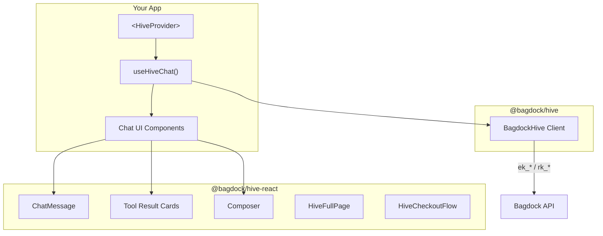
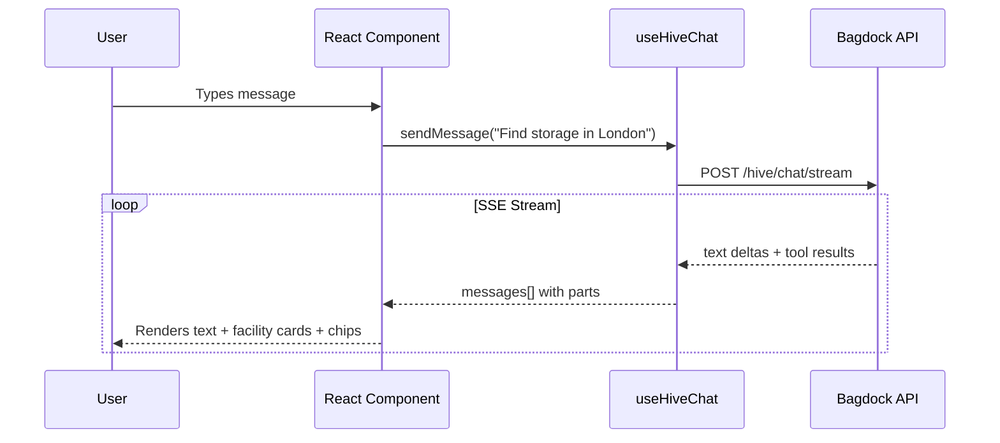
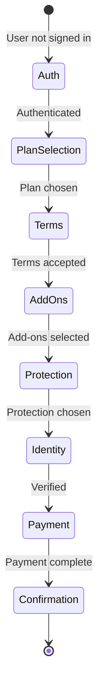

```
  ----++                                ----++                    ---+++     
  ---+++                                ---++                     ---++      
 ----+---     -----     ---------  --------++ ------     -----   ----++----- 
 ---------+ --------++----------++--------+++--------+ --------++---++---++++
 ---+++---++ ++++---++---+++---++---+++---++---+++---++---++---++------++++  
----++ ---++--------++---++----++---++ ---++---++ ---+---++     -------++    
----+----+---+++---++---++----++---++----++---++---+++--++ --------+---++   
---------++--------+++--------+++--------++ -------+++ -------++---++----++  
 +++++++++   +++++++++- +++---++   ++++++++    ++++++    ++++++  ++++  ++++  
                     --------+++                                             
                       +++++++                                               
```

# @bagdock/hive-react

React components and hooks for embedding Bagdock Hive — AI chat with streaming, rich tool results, checkout flows, and operator dashboards.

[](https://www.npmjs.com/package/@bagdock/hive-react)
[](LICENSE)

## Install

```bash
npm install @bagdock/hive-react @bagdock/hive react react-dom lucide-react
```

```bash
yarn add @bagdock/hive-react @bagdock/hive react react-dom lucide-react
```

```bash
pnpm add @bagdock/hive-react @bagdock/hive react react-dom lucide-react
```

```bash
bun add @bagdock/hive-react @bagdock/hive react react-dom lucide-react
```

**Peer dependencies:** `react >= 18`, `react-dom >= 18`, `lucide-react >= 0.300`

## How it fits together



### Data flow



---

## Use cases

### 1. Drop-in chat widget (simplest)

Add a floating AI chat button to any page in under 20 lines.

```tsx
import { useHiveChat } from '@bagdock/hive-react'

function ChatWidget() {
  const { messages, sendMessage, isLoading } = useHiveChat({
    apiKey: 'ek_live_...',
  })

  return (
    <div>
      {messages.map(msg => (
        <div key={msg.id}>
          <strong>{msg.role}:</strong> {msg.content}
        </div>
      ))}
      <input
        onKeyDown={(e) => {
          if (e.key === 'Enter') {
            sendMessage(e.currentTarget.value)
            e.currentTarget.value = ''
          }
        }}
        placeholder="Ask anything..."
      />
    </div>
  )
}
```

### 2. Rich chat with tool rendering

Render facility cards, loyalty tiers, quick-reply chips, and checkout flows from tool results.

```tsx
import { useHiveChat } from '@bagdock/hive-react'
import type { AIMessagePart } from '@bagdock/hive-react'

function RichChat() {
  const { messages, sendMessage, isLoading } = useHiveChat({
    apiKey: 'ek_live_...',
  })

  return (
    <div>
      {messages.map(msg => (
        <div key={msg.id}>
          {msg.parts?.map((part, i) => {
            if (part.type === 'text') return <p key={i}>{part.text}</p>

            if (part.type === 'tool-invocation' && part.state === 'result') {
              if (part.toolName === 'searchFacilities') {
                const { facilities } = part.output as any
                return facilities.map((f: any) => (
                  <FacilityCard key={f.id} facility={f} />
                ))
              }
              if (part.toolName === 'offerChoices') {
                const { choices } = part.output as any
                return choices.map((c: string) => (
                  <button key={c} onClick={() => sendMessage(c)}>{c}</button>
                ))
              }
            }
            return null
          })}
        </div>
      ))}
    </div>
  )
}
```

### 3. Custom tool renderers via HiveProvider

Use `HiveProvider` to inject custom renderers for specific tool results across your entire app.

```tsx
import { HiveProvider, useHiveChat, defaultRenderToolResult } from '@bagdock/hive-react'

function App() {
  return (
    <HiveProvider
      apiKey="ek_live_..."
      renderToolResult={(toolName, output, onSend) => {
        if (toolName === 'searchFacilities') {
          return <MyCustomFacilityGrid results={output} />
        }
        return defaultRenderToolResult(toolName, output, onSend)
      }}
    >
      <ChatPage />
    </HiveProvider>
  )
}
```

### 4. With server-side auth proxy

If your auth uses httpOnly cookies (e.g. Stytch session tokens), the JWT is not accessible to client-side JavaScript. Instead of passing an `apiKey` to `useHiveChat`, point `useChat` from the AI SDK at a local proxy route that handles authentication server-side.

```tsx
import { useMemo } from 'react'
import { useChat } from '@ai-sdk/react'
import { DefaultChatTransport } from 'ai'
import { HiveProvider, ChatMessage, LoadingMessage, Composer } from '@bagdock/hive-react'

function Chat() {
  const transport = useMemo(
    () => new DefaultChatTransport({ api: '/api/hive/stream' }),
    [],
  )
  const { messages, sendMessage, status } = useChat({ transport })
  const isLoading = status === 'submitted' || status === 'streaming'

  return (
    <HiveProvider appearance={{ theme: 'light', variables: { colorPrimary: '#4f46e5' } }}>
      <div>
        {messages.map((msg) => (
          <ChatMessage key={msg.id} message={msg} onSendMessage={sendMessage} />
        ))}
        {isLoading && <LoadingMessage />}
      </div>
    </HiveProvider>
  )
}
```

> **Note:** `useHiveChat({ apiKey })` is for **client-side auth only** (Clerk, Auth0, Firebase). When using httpOnly cookies, the proxy pattern replaces both the transport and key management. The embed key stays server-side as a regular env var (not `NEXT_PUBLIC_`).

### 5. Full-page agent experience

Pre-built full-page layout with header, message list, composer, and tool rendering.

```tsx
import { HiveFullPage } from '@bagdock/hive-react'

function CoraPage() {
  return (
    <HiveFullPage
      messages={messages}
      onSendMessage={sendMessage}
      isLoading={isLoading}
      agentName="Cora"
      suggestions={['Find storage near me', 'Compare prices']}
    />
  )
}
```

### 6. Operator dashboard integration

Embed the AI assistant into an operator dashboard with context-aware suggestions and inline hints.

```tsx
import {
  HiveAssistantStrip,
  HiveAssistantPanel,
  HiveInlineHint,
  HiveDashboardPrompt,
} from '@bagdock/hive-react'

function OperatorDashboard() {
  const [panelOpen, setPanelOpen] = useState(false)

  return (
    <div>
      <HiveAssistantStrip
        agentName="Cora"
        notificationCount={3}
        onClick={() => setPanelOpen(true)}
      />

      <HiveInlineHint
        title="3 invoices overdue"
        description="Cora can help you follow up"
        onAction={() => setPanelOpen(true)}
      />

      {panelOpen && (
        <HiveAssistantPanel
          messages={messages}
          onSendMessage={sendMessage}
          onClose={() => setPanelOpen(false)}
        />
      )}
    </div>
  )
}
```

### 7. Complete checkout flow

Multi-step checkout wizard with injectable callbacks for Stripe, identity verification, and protection plans.



```tsx
import { HiveCheckoutFlow } from '@bagdock/hive-react'

function Checkout({ facility, unit }) {
  return (
    <HiveCheckoutFlow
      facilityName={facility.name}
      unitDescription={unit.sizeDescription}
      monthlyPrice={unit.pricePerMonth}
      currency="GBP"
      availablePlans={plans}
      availableAddOns={addOns}
      availableProtectionPlans={protectionPlans}
      onInitCheckoutSession={async (params) => {
        return await myApi.createCheckoutSession(params)
      }}
      onCreatePaymentIntent={async (amount) => {
        return await stripe.paymentIntents.create({ amount })
      }}
      renderPaymentForm={(clientSecret) => (
        <Elements stripe={stripePromise} options={{ clientSecret }}>
          <PaymentForm />
        </Elements>
      )}
      onCreateIdentitySession={async () => {
        return await myApi.createVerificationSession()
      }}
      onComplete={(result) => {
        router.push(`/rentals/${result.rentalId}`)
      }}
    />
  )
}
```

---

## Appearance theming

Style all Hive components with a declarative `appearance` prop. Supports light, dark, and auto (system) presets with custom variable overrides.

```tsx
import { HiveProvider, DARK_THEME } from '@bagdock/hive-react'

function App() {
  return (
    <HiveProvider
      apiKey="ek_live_..."
      appearance={{ theme: 'dark' }}
    >
      <ChatPage />
    </HiveProvider>
  )
}
```

Custom variable overrides:

```tsx
<HiveProvider
  apiKey="ek_live_..."
  appearance={{
    theme: 'light',
    variables: {
      colorPrimary: '#0ea5e9',
      colorSurface: '#f0f9ff',
      fontFamily: '"Inter", sans-serif',
    },
  }}
>
```

Available theme variables: `colorPrimary`, `colorBackground`, `colorSurface`, `colorSurfaceUser`, `colorText`, `colorTextSecondary`, `colorBorder`, `colorSuccess`, `colorDanger`, `colorChipBg`, `colorChipText`, `colorCodeBg`, `fontFamily`, `fontFamilyMono`, `borderRadius`, `shadow`, and more.

## PII scrubbing

User messages are automatically scrubbed for PII before leaving the browser via `@bagdock/pii-patterns` — defense-in-depth redaction of emails, SSNs, phone numbers, IBANs, and 11 more patterns. Server-side WASM scrubbing remains authoritative.

---

## Component reference

### Hooks

| Hook | Returns | Description |
|------|---------|-------------|
| `useHiveChat(config)` | `UseHiveChatReturn` | Streaming chat with tool invocation parsing |
| `useHiveConfig()` | `HiveProviderConfig` | Access provider context (apiKey, renderToolResult) |

### `useHiveChat` config

| Prop | Type | Description |
|------|------|-------------|
| `apiKey` | `string` | **Required.** Embed key or restricted key |
| `operatorId` | `string` | Scope to a specific operator |
| `baseUrl` | `string` | API URL override for local dev |
| `initialMessages` | `AIMessage[]` | Pre-populate messages |
| `onSessionId` | `(id: string) => void` | Called when session ID is resolved |
| `onAgentChange` | `(agent: string) => void` | Called when the active agent context changes |

### `useHiveChat` return

| Property | Type | Description |
|----------|------|-------------|
| `messages` | `AIMessage[]` | All messages with `parts[]` for tool rendering |
| `isLoading` | `boolean` | `true` while streaming |
| `error` | `string \| null` | Last error message |
| `sessionId` | `string \| null` | Resolved session ID |
| `currentAgent` | `string \| null` | Active agent context |
| `showBranding` | `boolean` | Whether to show "powered by Bagdock" (controlled by plan) |
| `sendMessage` | `(text: string) => void` | Send a user message (auto-scrubs PII) |
| `clearMessages` | `() => void` | Reset the conversation |
| `setMessages` | `Dispatch<SetStateAction>` | Direct state access |

### Chat primitives

| Component | Description |
|-----------|-------------|
| `ChatMessage` | Single message bubble with role-based styling |
| `ChatMarkdown` | Renders markdown content with syntax highlighting |
| `ToolExecutionStep` | Shows tool execution state (loading, result) |
| `QuickReplyChips` | Clickable choice chips from `offerChoices` tool |
| `ReasoningBlock` | Collapsible block showing agent reasoning |
| `VerificationCard` | Identity verification status card |
| `LoadingMessage` | Typing indicator (animated dots) |
| `Composer` | Auto-resizing textarea with submit button |

### Built-in tool cards

| Component | Tool | Description |
|-----------|------|-------------|
| `SearchResultsCard` | `searchFacilities` | Facility list with chips, unit pills, and pricing |
| `FacilityDetailCard` | `selectFacility` / `openPreview` | Detailed facility preview with features |
| `AgentRentalsToolCard` | `getMyRentals` | List of active rentals |
| `PaymentSummaryCard` | `getMyNextPayment` | Upcoming payment details |
| `DashboardSummaryCard` | `getDashboardSummary` | Account overview |
| `LoyaltyCard` | `getMyLoyalty` | Tier, points, referral info |
| `AccountProfileCard` | `getMyProfile` | User profile details |

### High-level compositions

| Component | Description |
|-----------|-------------|
| `HiveFullPage` | Full-page chat layout (header + messages + composer) |
| `HiveChatPanel` | Side panel chat (like a support widget) |
| `HiveFloatingButton` | FAB that opens/closes the chat panel |
| `HiveAssistantStrip` | Top bar with agent status and notification count |
| `HiveAssistantPanel` | Slide-out panel for dashboard integration |
| `HiveInlineHint` | Contextual suggestion card |
| `HiveBadge` | "Powered by Bagdock" badge |
| `HiveDashboardPrompt` | Full-width prompt input for dashboards |
| `HiveSearchView` | Split view with facility grid + chat panel |

### Feature components

| Component | Description |
|-----------|-------------|
| `HiveCheckoutFlow` | Multi-step checkout wizard with injectable callbacks |
| `HiveHistoryPanel` | Chat session history list |
| `HiveInlineAuth` | Phone/email OTP authentication card |
| `HivePostRentalCard` | Confirmation card after checkout |
| `SecurePhoneInput` | Secure phone capture with country code picker |
| `OtpInput` | OTP verification input with resend cooldown and paste handling |

### Utility exports

| Export | Description |
|--------|-------------|
| `obfuscatePhone(countryCode, number)` | Mask a phone number for display (e.g. `+44 ****1234`) |
| `obfuscateEmail(email)` | Mask an email for display (e.g. `j****n@example.com`) |
| `DEFAULT_THEME` | Default light theme variables |
| `DARK_THEME` | Dark theme preset |
| `resolveTheme(appearance)` | Resolve appearance config to a full theme |
| `themeToStyle(variables)` | Convert theme variables to CSS custom properties |

### Backward compatibility

All `Hive*` components have deprecated aliases matching the original internal names:

```tsx
import { HiveChatPanel } from '@bagdock/hive-react'     // preferred
import { AIChatPanel } from '@bagdock/hive-react'       // deprecated alias

import { HiveFullPage } from '@bagdock/hive-react'      // preferred
import { CoraFullPage } from '@bagdock/hive-react'      // deprecated alias
```

---

## Message format

`useHiveChat` returns messages with a `parts` array for rich rendering:

```typescript
interface AIMessage {
  id: string
  role: 'user' | 'assistant'
  content: string
  timestamp: string
  parts?: AIMessagePart[]
  metadata?: AIMessageMetadata
}

interface AIMessagePart {
  type: 'text' | 'tool-invocation'
  text?: string
  state?: 'call' | 'partial-call' | 'result'
  toolCallId?: string
  toolName?: string
  args?: Record<string, unknown>
  output?: unknown
}
```

### Rendering pattern

```tsx
{message.parts?.map((part, i) => {
  if (part.type === 'text') {
    return <ChatMarkdown key={i} content={part.text} />
  }
  if (part.type === 'tool-invocation') {
    if (part.state !== 'result') {
      return <ToolExecutionStep key={i} toolName={part.toolName} />
    }
    return renderToolResult(part.toolName, part.output, sendMessage)
  }
})}
```

## Styling

Components use Tailwind CSS with CSS custom properties (`--hive-*`) for theming. Include the package in your Tailwind `content` config:

```javascript
// tailwind.config.js
module.exports = {
  content: [
    './src/**/*.{ts,tsx}',
    './node_modules/@bagdock/hive-react/dist/**/*.{js,mjs}',
  ],
}
```

All components fall back to sensible defaults when no `HiveProvider` is present, so they work out-of-the-box without theming configuration.

## License

MIT
